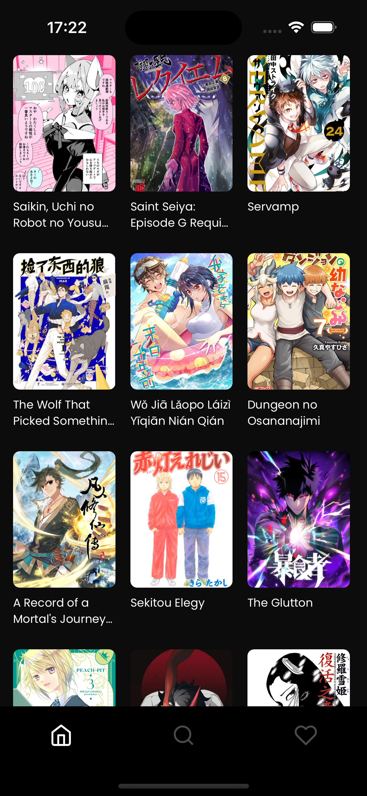
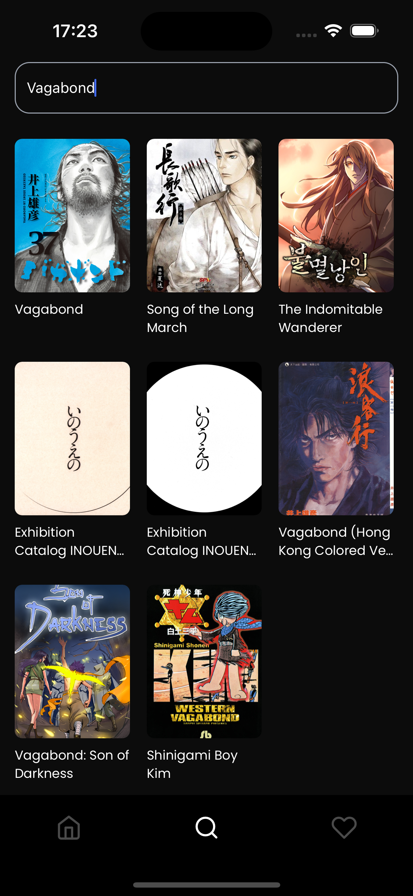
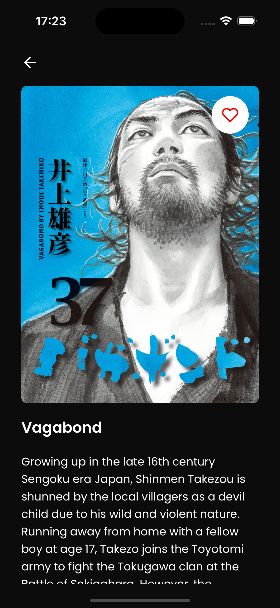
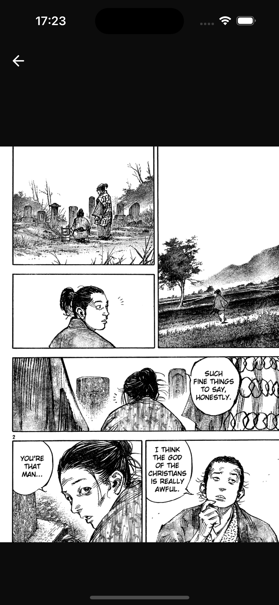
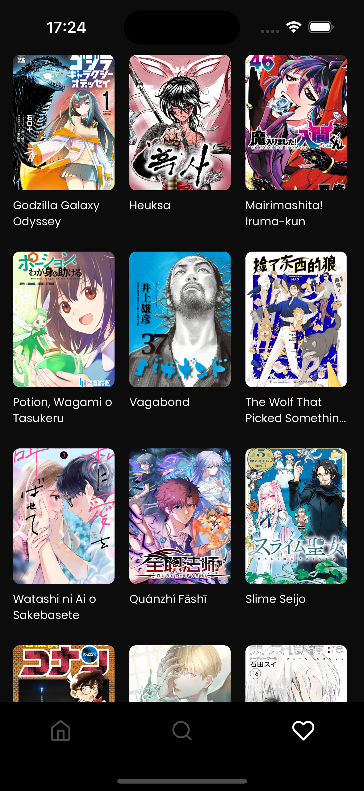

# Yomu — Manga Reader App

Yomu is a React Native application focused on manga reading.  
The app allows users to browse, search, read manga and manage favorites using the MangaDex platform.

This project consumes a single external API to handle all manga-related data.

- [MangaDex API](https://api.mangadex.org/docs/03-manga/) for manga, chapters, covers and authentication

---

### Setup Environment

Project created with **Expo (managed workflow)**.  
No native folders (`ios` / `android`) are required.

See the official Expo documentation to set up the environment:  
https://docs.expo.dev/get-started/installation/

---

### Env Variables

Create a file called `.env` in the root of the project with the following variables:

```

EXPO_PUBLIC_BASE_URL=https://api.mangadex.org
EXPO_PUBLIC_AUTH_URL=https://auth.mangadex.org/realms/mangadex/protocol/openid-connect/token
EXPO_PUBLIC_IMAGE_URL=https://uploads.mangadex.org/
EXPO_PUBLIC_GRANT_TYPE=password
EXPO_PUBLIC_GRANT_TYPE_REFRESH=refresh_token
EXPO_PUBLIC_USERNAME=your_username
EXPO_PUBLIC_PASSWORD=your_password
EXPO_PUBLIC_CLIENT_ID=your_client_id
EXPO_PUBLIC_CLIENT_SECRET=your_client_secret
```


There is an example file available at:

.env.example


---

### Run

**Install dependencies**

This project uses **pnpm**:

```
pnpm install
```


**Run the app**

```
pnpm start
```


**Run on iOS**

```
pnpm ios
```

**Run on Android**

```
pnpm android
```

**Run Tests**

```
pnpm test
```

---

### 🛠 Tech and Libraries

- [Expo](https://expo.dev/)
- [React Native](https://reactnative.dev/)
- [TypeScript](https://www.typescriptlang.org/)
- [React Navigation](https://reactnavigation.org/): Routing and navigation
- [Axios](https://github.com/axios/axios): Promise based HTTP client
- [TanStack React Query](https://tanstack.com/query/latest): Fetching, caching, synchronizing and updating server state
- [Zustand](https://zustand-demo.pmnd.rs/): Global state management
- [NativeWind](https://www.nativewind.dev/): Tailwind CSS for React Native
- [React Native SVG](https://github.com/software-mansion/react-native-svg)
- [Jest](https://jestjs.io/) and [Testing Library](https://testing-library.com/docs/react-native-testing-library/intro/) for testing

---

### App Screenshots
| Home | Search | Manga List | Manga Details | Favorites |
| :--: | :----: | :--------: | :-----------: | :-------: |
|  |  | |  |  |
